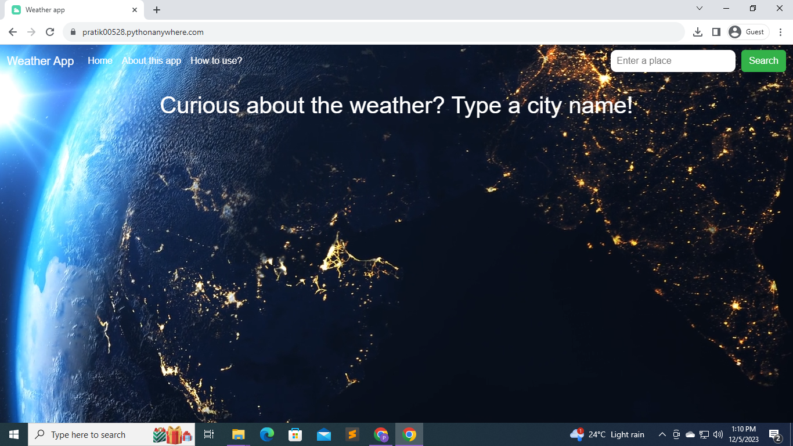
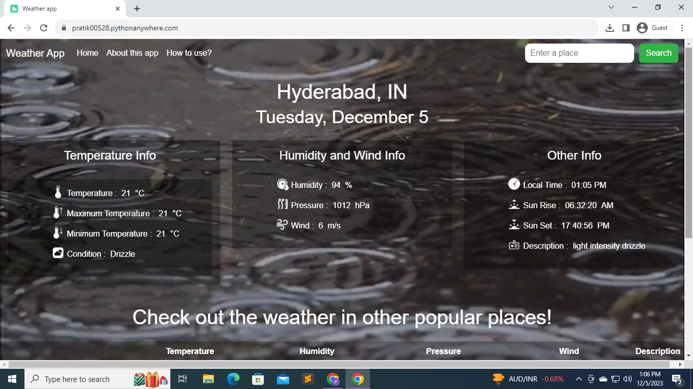
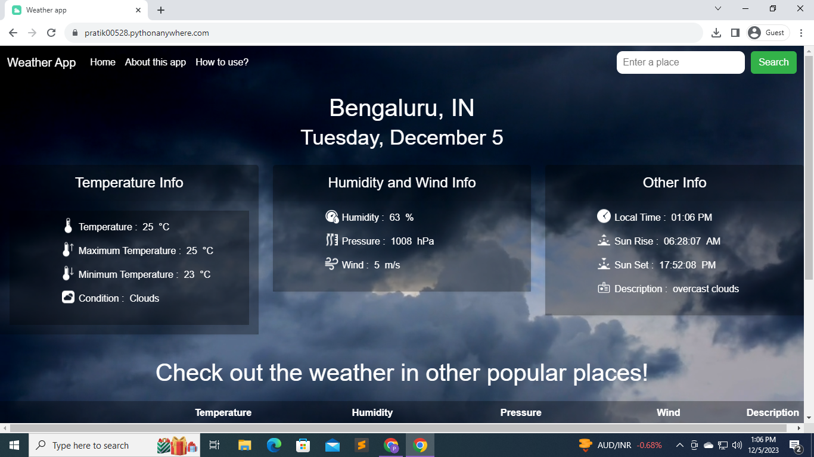
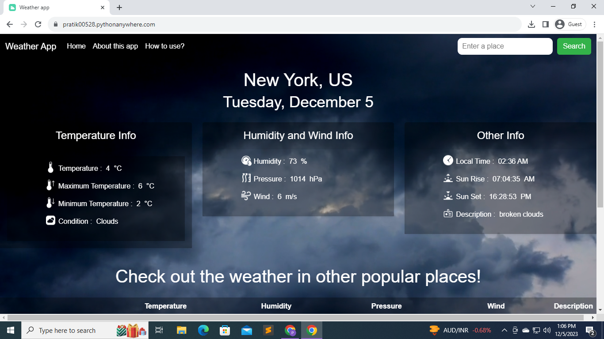
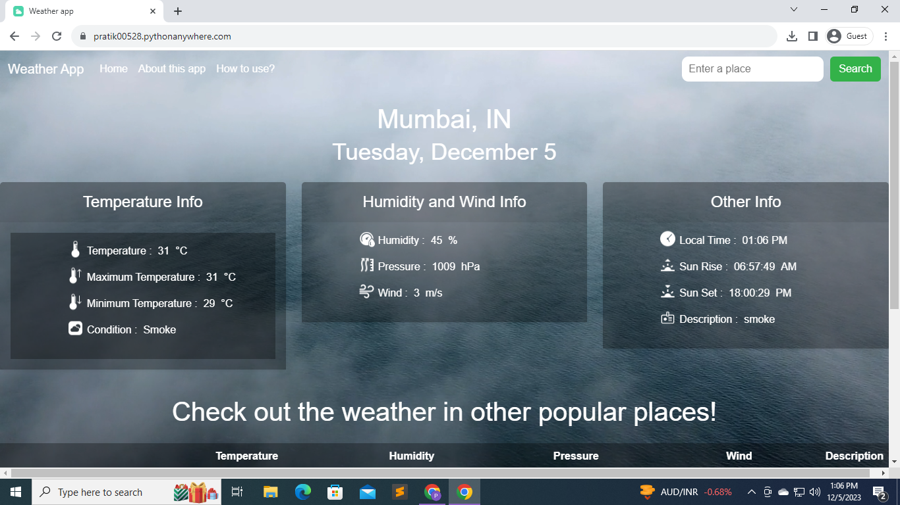
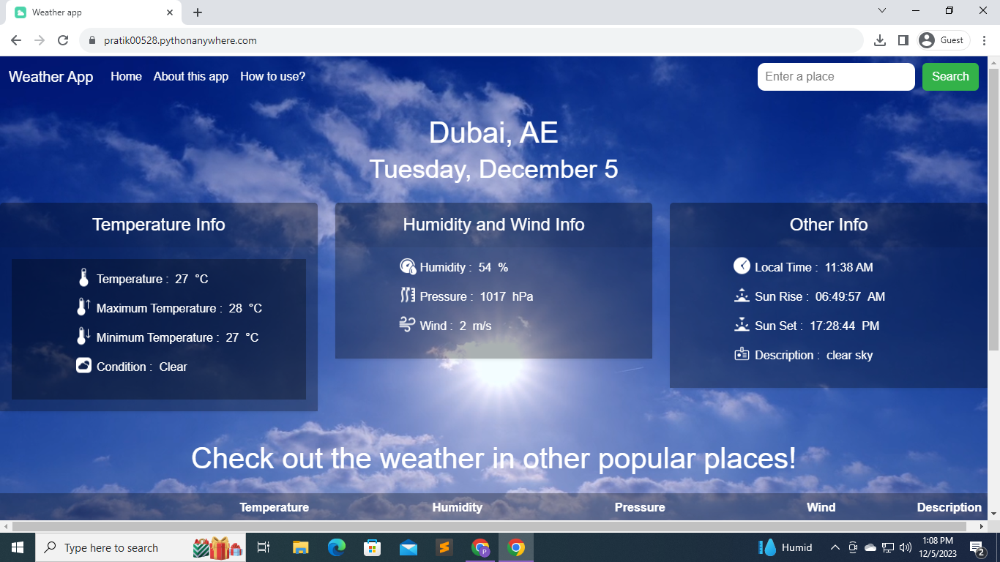
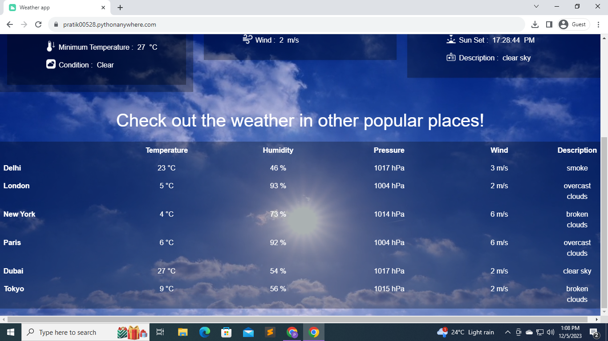

# Weather App

## Overview

Welcome to the Weather App! This application provides real-time weather updates for cities around the world. It leverages the OpenWeatherMap API to deliver accurate and timely information. Users can easily access a wide range of weather data, including temperature, humidity, wind speed, and more.

## Demo and Live Web-link

Watch a quick demo of the Weather App:

<video width="640" height="360" controls>
  <source src="./screenshots/demo_video.mp4" type="video/mp4">
  Your browser does not support the video tag.
</video>

### Experience the Weather App live! Visit the application at:

[Live Weather App](https://pratik00528.pythonanywhere.com/)

## Features

- **Real-Time Weather Data:** Get the latest weather information for any city globally.
- **Comprehensive Information:** Access detailed data such as temperature, humidity, pressure, and wind speed.
- **Visual Representation:** Icons and background videos correspond to the current weather conditions for a richer user experience.
- **User-Friendly Design:** Enjoy a responsive design that works seamlessly on both desktop and mobile devices.
- **Explore Other Cities:** Check out the weather in popular cities worldwide with just a few clicks.

## Screenshots

<!-- Add more screenshots if necessary -->

## How to Use

1. Visit the homepage of the Weather App.
2. Enter the city name in the search box.
3. Click the "Search" button.
4. View detailed weather information for the specified city.
5. Explore various weather parameters and enjoy background videos matching the weather conditions.

For a more detailed guide, check the [How to Use](https://pratik00528.pythonanywhere.com/how_to_use) page.

## About

Learn more about the Weather App, including its features and the technology behind it, on the [About](https://pratik00528.pythonanywhere.com/about) page.
